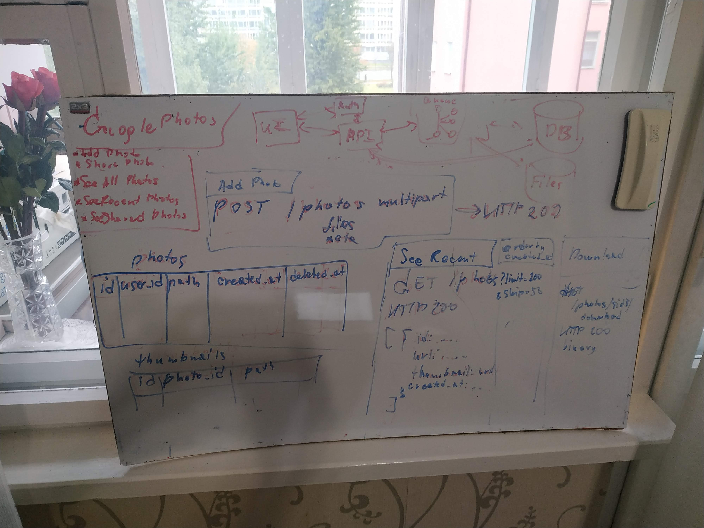
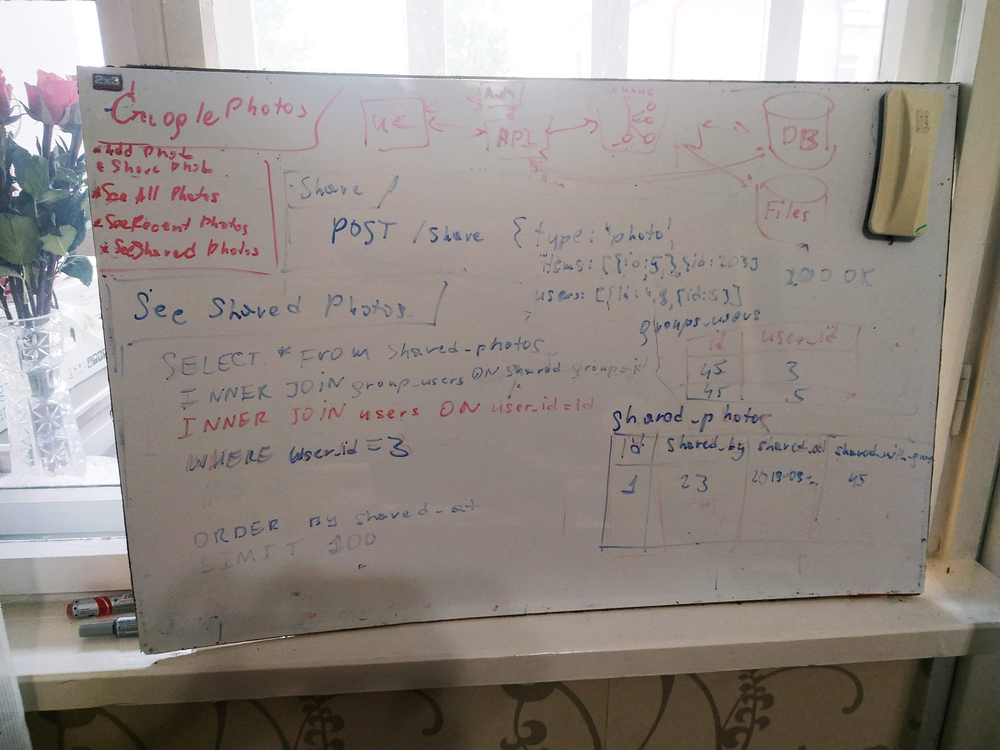
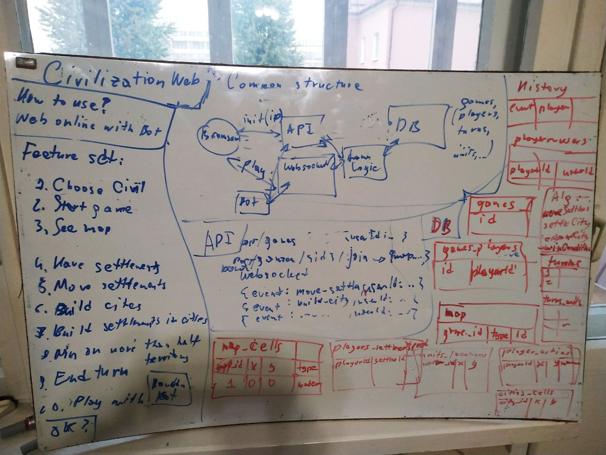
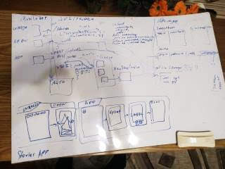

# leetcode
My solutions on Leetcode (Java, JavaScript, SQL, Golang)

## Solutions

*TODO replace leetcode id with Leetcode/InterviewBit/Pramp icons*

| Links | Topic | Difficulty | Runtime Beats | Memory Beats | Asked In | Category |
|------------------------------------------------------------------------------------|--------------------------------------------------------------------------------------------------------|------------|---------------|--------------|--------------------|----------|
| [](https://leetcode.com/problems/two-sum) | [Two Sum](/0001.Two_Sum) | Easy |  |  |  |  |
| [](https://leetcode.com/problems/add-two-numbers) [](https://www.interviewbit.com/problems/add-two-numbers-as-lists/) | [Add Two Numbers](/0002.Add_Two_Numbers) | Medium |  |  | `Amazon` `Microsoft` `Facebook` |  |
| [](https://leetcode.com/problems/longest-substring-without-repeating-characters/) [](https://www.interviewbit.com/problems/longest-substring-without-repeat/)| [Longest Substring Without Repeating Characters](/0003.Longest_Substring_Without_Repeating_Characters) | Medium | 71.90% | 77.87% | `Amazon` |  |
| [4](https://leetcode.com/problems/median-of-two-sorted-arrays/) | [Median of Two Sorted Arrays](/0004.Median_of_Two_Sorted_Arrays) | Hard |  |  |  |  |
| [](https://leetcode.com/problems/longest-palindromic-substring/) [](https://www.interviewbit.com/problems/longest-palindromic-substring/) | [Longest Palindromic Substring](/0005.Longest_Palindromic_Substring) | Medium |  |  | `Amazon` `Microsoft` `Groupon` |  |
| [7](https://leetcode.com/problems/reverse-integer) | [Reverse Integer](/0007.Reverse_Integer) | Easy |  |  |  |  |
| [](https://leetcode.com/problems/string-to-integer-atoi/) [](https://www.interviewbit.com/problems/atoi/)| [String to Integer (atoi)](/0008.String_to_Integer_atoi) | Medium | 60.06% | 100% | `Adobe` `Nvidia` `Amazon` `Microsoft` `Apple` |  |
| [9](https://leetcode.com/problems/palindrome-number) | [Palindrome Number](/0009.Palindrome_Number) | Easy |  |  |  |  |
| [10](https://leetcode.com/problems/regular-expression-matching) | [Regular Expression Matching](/0010.Regular_Expression_Matching) | Hard |  |  |  |  |
| [](https://leetcode.com/problems/container-with-most-water/) [](https://www.interviewbit.com/problems/container-with-most-water/)| [Container With Most Water](/0011.Container_With_Most_Water) | Medium | 94.83% | 95.51% | `Amazon` `Facebook` `Google` `Adobe` |  |
| [](https://leetcode.com/problems/roman-to-integer/) [](https://www.interviewbit.com/problems/roman-to-integer/)| [Roman to Integer](/0013.Roman_to_Integer) | Easy | 5.04% | 100% | `Amazon` `Facebook` `Microsoft` `Twitter` |  |
| [](https://leetcode.com/problems/longest-common-prefix) [](https://www.interviewbit.com/problems/longest-common-prefix/)| [Longest Common Prefix](/0014.Longest_Common_Prefix) | Easy |  |  | `Google` |  |
| [](https://leetcode.com/problems/merge-two-sorted-lists/) | [Merge Two Sorted Lists](/0021.Merge_Two_Sorted_Lists) | Easy | 100% | 9.70% |  |  |
| [](https://leetcode.com/problems/letter-combinations-of-a-phone-number/) [](https://www.interviewbit.com/problems/letter-phone/)| [Letter Combinations of a Phone Number](/0017.Letter_Combinations_of_a_Phone_Number) | Medium | 49.62% | 60.71% | `Microsoft` |  |
| [](https://leetcode.com/problems/merge-k-sorted-lists/) [](https://www.interviewbit.com/problems/merge-k-sorted-lists/)| [Merge k Sorted Lists](/0023.Merge_k_Sorted_Lists) | Hard | 50.80% | 55.19% | `Amazon` `Google` |  |
| [](https://leetcode.com/problems/remove-duplicates-from-sorted-array/) [](https://www.interviewbit.com/problems/remove-duplicates-from-sorted-array/)| [Remove Duplicates from Sorted Array](/0026.Remove_Duplicates_from_Sorted_Array) | Easy | 96.96% | 93.09% | `Amazon` `Google` `Microsoft` `United Healthgroup` `Expedia` |  |
| [](https://leetcode.com/problems/implement-strstr/) [](https://www.interviewbit.com/problems/implement-strstr/)| [Implement strStr](/0028.Implement_strStr) | Easy | 100% | 100% | `Facebook` `Amazon` `Qualcomm` `Wipro` `Microsoft` |  |
| [](https://leetcode.com/problems/substring-with-concatenation-of-all-words/) [](https://www.interviewbit.com/problems/substring-concatenation/)| [Substring with Concatenation of All Words](/0030.Substring_with_Concatenation_of_All_Words) | Hard | 22.61% | 47.62% | `Facebook` |  |
| [](https://leetcode.com/problems/search-in-rotated-sorted-array/) [](https://www.interviewbit.com/problems/rotated-sorted-array-search/)| [Search in Rotated Sorted Array](/0033.Search_in_Rotated_Sorted_Array) | Medium | 100% | 7.55% | `Facebook` `Google` `Microsoft` `Amazon` |  |
| [](https://leetcode.com/problems/valid-sudoku/) [](https://www.interviewbit.com/problems/valid-sudoku/)| [Valid Sudoku](/0036.Valid_Sudoku) | Medium | 48.42% | 95.65% | `Google` `Amazon` |  |
| [](https://leetcode.com/problems/sudoku-solver/) [](https://www.interviewbit.com/problems/sudoku/)| [Sudoku Solver](/0037.Sudoku_Solver) | Hard | 16.51% | 73.68% | `Microsoft` |  |
| [](https://leetcode.com/problems/permutations/) [](https://www.interviewbit.com/problems/permutations/)| [Permutations](/0046.Permutations) | Medium | 10.94% | 95.74% | `Google` `Adobe` `Microsoft` |  |
| [48](https://leetcode.com/problems/rotate-image/) | [Rotate Image](/0048.Rotate_Image) | Medium | 100% | 98.24% | `Google` `Facebook` `Amazon` |  |
| [](https://leetcode.com/problems/group-anagrams/) [](https://www.interviewbit.com/problems/anagrams/)| [Group Anagrams](/0049.Group_Anagrams) | Medium | 17.29% | 56.52% | `Microsoft` `Amazon` |  |
| [53](https://leetcode.com/problems/maximum-subarray/) | [Maximum Subarray](/0053.Maximum_Subarray) | Easy | 88% | 7% | `Facebook` `Paypal` `Amazon` `LinkedIn` `Microsoft` `Yahoo` |  |
| [56](https://leetcode.com/problems/merge-intervals/) | [Merge Intervals](/0056.Merge_Intervals) | Medium | 25% | 99% | `Google` `Amazon` |  |
| [](https://leetcode.com/problems/length-of-last-word/)[](https://www.interviewbit.com/problems/length-of-last-word/) | [Length of Last Word](/0058.Length_of_Last_Word) | Easy | 100% | 100% | `Amazon` |  |
| [59](https://leetcode.com/problems/spiral-matrix-ii) | [Spiral Matrix II](/0014.Spiral_Matrix_II) | Medium |  |  |  |  |
| [](https://leetcode.com/problems/permutation-sequence/)[](https://www.interviewbit.com/problems/kth-permutation-sequence/) | [Permutation Sequence](/0060.Permutation_Sequence) | Medium | 36.56% | 100% | `Amazon` |  |
| [62](https://leetcode.com/problems/unique-paths/) | [Unique Paths](/0062.Unique_Paths) | Medium |  |  |  |  |
| [](https://leetcode.com/problems/sqrtx/)[](https://www.interviewbit.com/problems/square-root-of-integer/) | [Sqrt(x)](/0069.Sqrt_x) | Easy | 100% | 5% | `Facebook` `Amazon` `Microsoft` |  |
| [](https://leetcode.com/problems/simplify-path/)[](https://www.interviewbit.com/problems/simplify-directory-path/) | [Simplify Path](/0071.Simplify_Path) | Medium | 85.44% | 100.00% | `Microsoft` |  |
| [73](https://leetcode.com/problems/set-matrix-zeroes/) | [Set Matrix Zeroes](/0073.Set_Matrix_Zeroes) | Medium | 100% | 5% | `Oracle` `Amazon` |  |
| [](https://leetcode.com/problems/subsets/)[](https://www.interviewbit.com/problems/subset/) | [Subsets](/0071.Simplify_Path) | Medium | 100.00% | 99.18% | `Microsoft` `Amazon` |  |
| [83](https://leetcode.com/problems/remove-duplicates-from-sorted-list/) | [Remove Duplicates from Sorted List](/0083.Remove_Duplicates_from_Sorted_List) | Easy | 100% | 100% | `Microsoft` `VMWare` |  |
| [](https://leetcode.com/problems/largest-rectangle-in-histogram/) [](https://www.interviewbit.com/problems/largest-rectangle-in-histogram/)| [Largest Rectangle in Histogram](/0084.Largest_Rectangle_in_Histogram) | Hard | 85.75% | 93.18% | `Amazon` `Facebook` `Google` |  |
| [](https://leetcode.com/problems/subsets-ii/) [](https://www.interviewbit.com/problems/subsets-ii/)| [Subsets II](/0090.Subsets_II) | Medium | 99.88% | 98.53% | `Amazon` `Microsoft` |  |
| [](https://leetcode.com/problems/reverse-linked-list-ii/submissions/) [](https://www.interviewbit.com/problems/reverse-link-list-ii/)| [Roman to Integer](/0092.Reverse_Linked_List_II) | Medium | 100% | 100% | `Amazon` `Facebook` `Microsoft` |  |
| [](https://leetcode.com/problems/binary-tree-level-order-traversal/) [](https://www.interviewbit.com/problems/level-order/)| [Binary Tree Level Order Traversal](/0102.Binary_Tree_Level_Order_Traversal) | Medium | 78.95% | 23.53% | `Facebook` |  |
| [118](https://leetcode.com/problems/pascals-triangle/) | [Pascal's Triangle](/0118.Pascal_Triangle) | Easy |  |  |  |  |
| [121](https://leetcode.com/problems/best-time-to-buy-and-sell-stock/) | [Best Time to Buy and Sell Stock](0121.Best_Time_to_Buy_and_Sell_Stock) | Easy |  |  |  |  |
| [](https://leetcode.com/problems/best-time-to-buy-and-sell-stock-ii/) | [Best Time to Buy and Sell Stock II](/0122.Best_Time_to_Buy_and_Sell_Stock_II) | Easy | 93.37% | 90.00% | `Amazon` |  |
| [](https://leetcode.com/problems/single-number/)[](https://www.interviewbit.com/problems/single-number/) | [Single Number](/0136.Single_Number) | Easy | 85.61% | 71.15% | `Amazon` |  |
| [](https://leetcode.com/problems/linked-list-cycle-ii/)[](https://www.interviewbit.com/problems/list-cycle/) | [Linked List Cycle II](/0142.Linked_List_Cycle_II) | Medium | 100% | 11.00% | `Amazon` `Microsoft` `NetApp` |  |
| [146](https://leetcode.com/problems/lru-cache) | [LRU Cache](/0146.LRU_Cache) | Hard |  |  |  |  |
| [](https://leetcode.com/problems/insertion-sort-list/) [](https://www.interviewbit.com/problems/insertion-sort-list/) | [Insertion Sort List](/0147.Insertion_Sort_List) | Medium | 63.32% | 100% | `Microsoft` `Google` |  |
| [](https://leetcode.com/problems/max-points-on-a-line/) [](https://www.interviewbit.com/problems/points-on-the-straight-line/) | [Max Points on a Line](/0149.Max_Points_on_a_Line) | Hard | 87.96% | 85.71% | `Google` `Amazon` |  |
| [](https://leetcode.com/problems/evaluate-reverse-polish-notation/) [](https://www.interviewbit.com/problems/evaluate-expression/) | [Evaluate Reverse Polish Notation](/0150.Evaluate_Reverse_Polish_Notation) | Medium | 50.67% | 100% | `Yahoo` `Google` `Facebook` |  |
| [](https://leetcode.com/problems/reverse-words-in-a-string/) | [Reverse Words in a String](/0151.Reverse_Words_in_a_String) | Medium | 53.91% | 55.91% |  |  |
| [](https://leetcode.com/problems/min-stack/) | [Min Stack](/0155.Min_Stack) | Easy | 85.92% | 50.00% | `Amazon` `Microsoft` `Adobe` `Yahoo` |  |
| [](https://leetcode.com/problems/compare-version-numbers/) | [Compare Version Numbers](/0165.Compare_Version_Numbers) | Easy | 90.70% | 100% |  |  |
| [172](https://leetcode.com/problems/factorial-trailing-zeroes/) | [Factorial Trailing Zeroes](/0172.Factorial_Trailing_Zeroes) | Easy |  |  |  |  |
| [175](https://leetcode.com/problems/combine-two-tables) | [Combine Two Tables](/0175.Combine_Two_Tables) | Easy |  |  |  |  |
| [176](https://leetcode.com/problems/second-highest-salary) | [Second Highest Salary](/0176.Second_Highest_Salary) | Easy |  |  |  |  |
| [177](https://leetcode.com/problems/nth-highest-salary) | [Nth Highest Salary](/0177.Nth_Highest_Salary) | Medium |  |  |  |  |
| [178](https://leetcode.com/problems/rank-scores) | [Rank Scores](/0178.Rank_Scores) | Medium |  |  |  |  |
| [180](https://leetcode.com/problems/consecutive-numbers) | [Consecutive Numbers](/0180.Consecutive_Numbers) | Medium |  |  |  |  |
| [181](https://leetcode.com/problems/employees-earning-more-than-their-managers) | [Employees Earning More Than Their Managers](/0181.Employees_Earning_More_Than_Their_Managers) | Easy |  |  |  |  |
| [182](https://leetcode.com/problems/duplicate-emails) | [Duplicate Emails](/0182.Duplicate_Emails) | Easy |  |  |  |  |
| [183](https://leetcode.com/problems/customers-who-never-order) | [Customers Who Never Order](/0183.Customers_Who_Never_Order) | Easy |  |  |  |  |
| [184](https://leetcode.com/problems/department-highest-salary) | [Department Highest Salary](/0184.Department_Highest_Salary) | Medium |  |  |  |  |
| [185](https://leetcode.com/problems/department-top-three-salaries) | [Department Top Three Salaries](/0185.Department_Top_Three_Salaries) | Hard |  |  |  |  |
| [](https://leetcode.com/problems/number-of-1-bits/)[](https://www.interviewbit.com/problems/number-of-1-bits/) | [Number of 1 Bits](/0191.Number_of_1_Bits) | Easy | 52.63% | 5.41% | `Adobe` `Yahoo` |  |
| [196](https://leetcode.com/problems/delete-duplicate-emails) | [Delete Duplicate Emails](/0196.Delete_Duplicate_Emails) | Easy |  |  |  |  |
| [197](https://leetcode.com/problems/rising-temperature) | [Rising Temperature](/0197.Rising_Temperature) | Easy |  |  |  |  |
| [207](https://leetcode.com/problems/course-schedule/) | [Course Schedule](/0207.Course_Schedule) | Medium |  |  |  |  |
| [234](https://leetcode.com/problems/palindrome-linked-list/) | [Palindrome Linked List](/0234.Palindrome_Linked_List) | Easy |  |  |  |  |
| [242](https://leetcode.com/problems/valid-anagram/) | [Valid Anagram](/0242.Valid_Anagram) | Easy |  |  |  |  |
| [262](https://leetcode.com/problems/trips-and-users) | [Trips and Users](/0262.Trips_and_Users) | Hard |  |  |  |  |
| [](https://leetcode.com/problems/move-zeroes)  | [Move Zeroes](/0283.Move_Zeroes) | Easy | 83.84% | 40.42% | | |
| [287](https://leetcode.com/problems/find-the-duplicate-number/) | [Find the Duplicate Number](0287.Find_the_Duplicate_Number) | Medium |  |  |  |  |
| [324](https://leetcode.com/problems/wiggle-sort-ii) | [Wiggle Sort II](/0324.Wiggle_Sort_II) | Medium |  |  |  |  |
| [](https://leetcode.com/problems/n-ary-tree-level-order-traversal/) | [N-ary Tree Level Order Traversal](/0429.Nary_Tree_Level_Order_Traversal) | Easy | 72.70% | 40.00% |  |  |
| [](https://leetcode.com/problems/diameter-of-binary-tree/) | [Diameter of Binary Tree](/0543.Diameter_of_Binary_Tree) | Easy | 44.03% | | | |
| [554](https://leetcode.com/problems/brick-wall/) | [Brick Wall](/0554.Brick_Wall) | Medium |  |  |  |  |
| [595](https://leetcode.com/problems/big-countries) | [Big Countries](/0595.Big_Countries) | Easy |  |  |  |  |
| [596](https://leetcode.com/problems/classes-more-than-5-students) | [Classes More Than 5 Students](/0596.Classes_More_Than_5_Students) | Easy |  |  |  |  |
| [601](https://leetcode.com/problems/human-traffic-of-stadium) | [Human Traffic of Stadium](/0601.Human_Traffic_of_Stadium) | Hard |  |  |  |  |
| [620](https://leetcode.com/problems/not-boring-movies) | [Not Boring Movies](/0620.Not_Boring_Movies) | Easy |  |  |  |  |
| [626](https://leetcode.com/problems/exchange-seats) | [Exchange Seats](/0626.Exchange_Seats) | Medium |  |  |  |  |
| [627](https://leetcode.com/problems/swap-salary) | [Swap Salary](/0627.Swap_Salary) | Easy |  |  |  |  |
| [783](https://leetcode.com/problems/minimum-distance-between-bst-nodes) | [Minimum Distance Between BST Nodes](/0783.Minimum_Distance_Between_BST_Nodes) | Easy |  |  |  |  |
| [](https://leetcode.com/problems/backspace-string-compare/)| [Backspace String Compare](/0844.Backspace_String_Compare) | Easy | 98.62% | 66.67% | | |
| [848](https://leetcode.com/problems/shifting-letters) | [Shifting Letters](/0848.Shifting_Letters) | Medium |  |  |  |  |
| [876](https://leetcode.com/problems/middle-of-the-linked-list) | [Middle of the Linked List](/0876.Middle_of_the_Linked_List) | Easy | 97.28% | 33.33% |  |  |
| [884](https://leetcode.com/problems/uncommon-words-from-two-sentences/) | [Uncommon Words from Two Sentences](/0884.Uncommon_Words_from_Two_Sentences) | Easy |  |  |  |  |
| [893](https://leetcode.com/problems/groups-of-special-equivalent-strings) | [Groups of Special-Equivalent Strings](/0893.Groups_of_Special-Equivalent_Strings) | Easy |  |  |  |  |
| [896](https://leetcode.com/problems/monotonic-array) | [Monotonic Array](/0896.Monotonic_Array) | Easy |  |  |  |  |
| [912](https://leetcode.com/problems/sort-an-array/) | [Sort an Array](/0912.Sort_an_Array) | Medium |  |  |  |  |
| [1039](https://leetcode.com/problems/minimum-score-triangulation-of-polygon/) | [Minimum Score Triangulation of Polygon](/1039.Minimum_Score_Triangulation_of_Polygon) | Medium |  |  |  |  |
| [](https://leetcode.com/explore/featured/card/30-day-leetcoding-challenge/528/week-1/3289/) | [Counting Elements](/3289.Counting_Elements) | Easy | | | | |
| [](https://leetcode.com/explore/featured/card/30-day-leetcoding-challenge/529/week-2/3297/) | [Last Stone Weight](/3297.Last_Stone_Weight) | Easy | 34.22% | | | |
| [](https://leetcode.com/explore/featured/card/30-day-leetcoding-challenge/529/week-2/3298/) | [Contiguous Array](/3298.Contiguous_Array) | Medium | 97.34% | | | |
| [](https://leetcode.com/explore/featured/card/30-day-leetcoding-challenge/529/week-2/3299/) | [Perform String Shifts](/3299.Perform_String_Shifts) | | | | | |
| [](https://leetcode.com/submissions/detail/325181931/?from=/explore/challenge/card/30-day-leetcoding-challenge/530/week-3/3300/) | [Product of Array Except Self](/3300.Product_of_Array_Except_Self) | Medium | 89.52% | 16.00% | | |
| [](https://leetcode.com/explore/challenge/card/30-day-leetcoding-challenge/530/week-3/3301/) | [Valid Parenthesis String](/3301.Valid_Parenthesis_String) | Medium | 52.73% | | | |
| [](https://leetcode.com/explore/challenge/card/30-day-leetcoding-challenge/530/week-3/3302/) [](https://www.pramp.com/challenge/yZm60L6d5juM7K38KYZ6) | [Island Count](/Pramp.Island_Count) | Medium | 75.42% | 74.19% |  |  |
| [](https://leetcode.com/explore/featured/card/30-day-leetcoding-challenge/530/week-3/3303/) | [Minimum Path Sum](/3303.Minimum_Path_Sum) | Medium | 85.44% | 100.00% | | |
| [](https://leetcode.com/explore/featured/card/30-day-leetcoding-challenge/530/week-3/3304/) | [Search in Rotated Sorted Array
](/3304.Search_in_Rotated_Sorted_Array) | Medium | 85.41% | 42.31% | | |
| [](https://leetcode.com/explore/featured/card/30-day-leetcoding-challenge/530/week-3/3305/) | [Construct Binary Search Tree from Preorder Traversal](/3305.Construct_Binary_Search_Tree_from_Preorder_Traversal) | Medium | 32.37% | 80.00% | | |
| [](https://leetcode.com/explore/featured/card/30-day-leetcoding-challenge/530/week-3/3306/) | [Leftmost Column with at Least a One](/3306.Leftmost_Column_with_at_Least_a_One) | Medium | | | | |
| [](https://leetcode.com/explore/challenge/card/30-day-leetcoding-challenge/531/week-4/3307/) | [Subarray Sum Equals K](/3306.Subarray_Sum_Equals_K) | Medium | 95.57% | 50.00% | | |
| [](https://www.interviewbit.com/problems/wave-array/) | [Wave Array](/InterviewBit.Wave_Array) | Easy |  |  |  |  |
| [](https://www.interviewbit.com/problems/simple-queries/) | [Simple Queries](/InterviewBit.Simple_Queries) | Hard |  |  |  |  |
| [](https://www.interviewbit.com/problems/maxspprod/) | [MAXSPPROD](/InterviewBit.MAXSPPROD) | Medium |  |  |  |  |
| [](https://www.interviewbit.com/problems/amazing-subarrays/) | [Amazing Subarrays](/InterviewBit.Amazing_Subarrays) | Easy |  |  |  |  |
| [](https://www.interviewbit.com/problems/pretty-json/) | [Pretty Json](/InterviewBit.Pretty_Json) | Medium |  |  | `Facebook` `Microsoft` |  |
| [](https://www.interviewbit.com/problems/min-xor-value/) | [Min XOR value](/InterviewBit.Min_XOR_value) | Medium |  |  | `Booking.com` |  |
| [](https://www.interviewbit.com/tutorial/two-pointers/) | [Two Pointers](/InterviewBit.Two_Pointers) | Easy |  |  |  |  |
| [](https://www.interviewbit.com/problems/search-for-a-range/) | [Search for a Range](/InterviewBit.Search_for_a_Range) | Medium |  |  | `Google` `Microsoft` |  |
| [](https://www.interviewbit.com/problems/implement-power-function/) | [Implement Power Function](/InterviewBit.Implement_Power_Function) | Hard |  |  | `Google` `LinkedIn` |  |
| [](https://www.interviewbit.com/problems/intersection-of-sorted-arrays/) | [Intersection Of Sorted Arrays](/InterviewBit.Intersection_Of_Sorted_Arrays) | Easy |  |  | `Google` `Facebook` |  |
| [](https://www.interviewbit.com/problems/3-sum-zero/) | [3 Sum Zero](/InterviewBit.3_Sum_Zero) | Medium |  |  | `Google` `Facebook` |  |
| [](https://www.interviewbit.com/problems/minimize-the-absolute-difference/) | [Minimize The Absolute Difference](/InterviewBit.Minimize_The_Absolute_Difference) | Medium |  |  | `Microsoft` |  |
| [](https://www.interviewbit.com/problems/short-films/) | [Short Films](/InterviewBit.Short_Films) | Easy |  |  |  |  |
| [](https://www.pramp.com/challenge/3QnxW6xoPLTNl5jX5Lg1) | [Time Planner](/Pramp.Time_Planner) | Medium |  |  |  |  |
| [](https://www.pramp.com/challenge/VKdqbrq6B1S5XAyGAOn4) | [Sentence Reverse](/Pramp.Sentence_Reverse) | Medium |  |  |  |  |
| [](https://www.pramp.com/challenge/15oxrQx6LjtQj9JK9XlA) | [Find The Duplicates](/Pramp.Find_The_Duplicates) | Easy |  |  |  |  |
| [](https://www.pramp.com/challenge/jKoA5GAVy9Sr9jGBjz04) | [Array Index & Element Equality](/Pramp.Array_Index_&_Element_Equality) | Medium |  |  |  |  |

# System design

## Steps

1. Ask about how it is going to be used (inputs/outputs of the system)
2. Describe feature set
3. Ask about assumptions/constraints (business corner cases, how many users, how much data to handle, how many requests per second, read to write ratio)
4. Detect several difficulties/corner cases and potential solutions.
5. Draw high-level component structure
6. Think about and draw complex parts of system (API schema/DB schema/algorithms/...)
7. Back-of-the-envelope calculations (how big DB we need for 1 million users)
8. Scaling (vertical/horizontal/caching/load balancing/replications/sharding/auto scaling/...)
9. Estimates/Prices (optional)

## Practice

### World sentiment online

Design sentiment analysis system from a real-time stream from Twitter.

**Assumptions**
- Function to get emotion from text is already trained and implemented
- Twitter firehose is going to be used (twitter messages streaming)

**Feature set**
- See average city mood (webapp)

**Tricky parts:**
- Realtime
- 5 secs latency
- What to store?

**Design**
- `Tweeter stream` -> `Balanced Services` -> `Queue` -> `Consumer` -> `Cloud Function` `Basic Filter` `Neural Network` -> `{ mood, country+city, date }` -> `Time-series database` / `Clickhouse`
- `UI` -> Choose country + dates -> API -> `Time-series database`

### Pastebin

Design Pastebin, a website where you can store and share text online for a set period of time.

Note: Bit.ly is a similar service, with the distinction that Pastebin requires storing the paste contents instead of the original unshortened URL.

**Features scope**

- Create a link
- Immutable text
- See text by this link
- No authentication

**Constraints**

- Maximum period of time - 1 month
- Just text? encoding? -
- Limit of text - 1000 chars
- How many users I expect? - 1000...10 millions
- How many links can be created per second by single ip-user? 5
- How much data I expect? -
  FROM 1000*10*1000\*4b = 40MB per day => 1GB per month
  TO => 10TB per month

**API design**

```
POST mysite.by/notes { text: 'bblblladsasd' }
{
  url: 'mysite.by/notes/23basda',
  expired_at: 'iso8601'
}
```

GET mysite.by/notes/23basda { text: 'bblblladsasd' }

**Data model**

```
{
  id: long,
  text: varchar(1000),
  shared_key: varchar(10) unique,
  created_at: date,
  deleted_at: date
}
```

**Pseudo code components**

random('0-9A-Z') -> 123456
retry after transaction

UI -> API -> DB


https://sketchboard.me/pBPw4RPhzoAJ#/

### Scale on the Cloud

**Features scope**

Request -> Processing -> Store -> Response
e.g. user clicks to red or blue button, it sends to our DB.

Let's assume that we have simple application with 1 endpoint. API is deployed to single AWS EC2, DB is deployed to strong machine with AWS RDS

P.S. Actually, if application has just one endpoint, I would probably try AWS Lambda. It might be cheaper.

**API design**

POST /clicks { color: 'red' } -> process smth (take ip, find)

**Data model/schema**

Clicks: { id: long, ip: string, color: string, created_at: date }

**How to scale?**

Vertically (add memory and CPU to API and DB machines)

Horizontally

For API

1. Load balancer and several API instances on separate machines. It will detects requests of API.
2. Monitoring tool for applications and machines.
3. Some kind of reverse-proxy at the first layer to protect from attacks.
4. Probably some kind of autoscaling (like Kubernetes does) to stop unused machines and run new machine if load is too large.
5. Add EC2 on different zones according to the audience
6. Make code working in parallel if possible
   (No microservices, cause endpoint is single)

For DB

1. Choose valid DB according to use-cases (postgres/mongo/clickhouse/...)
2. Configure DB well (valid DB for the case, indexes, tested max_connection limit, backups)
3. Replication via any option (master-master/master-workers/...)
4. Shard (store different parts of DB in different machines)

P.S. If response is not important to be urgent, we can use queue like Kafka or whatever to do some processing afterwards and send response like 202 (Accepted)

**Development time**

Simple app (API + DB locally) - 1d
Set up AWS (roles/networks/ec2/rds) - 1w
Configure DB on AWS RDS - 2d
Configure app deployment to AWS EC2 - 3d

Later:
Load balancer - 3d
Monitoring - 1w
Apps auto-scaling - 1w
DB replications - 1w
DB sharding - 1w

**Reference links**

- Best link ever - https://github.com/donnemartin/system-design-primer/tree/master/solutions/system_design/scaling_aws#design-a-system-that-scales-to-millions-of-users-on-aws
- AWS EC2 Pricing - https://aws.amazon.com/ec2/pricing/
- AWS RDS Pricing - https://aws.amazon.com/rds/pricing/
- AWS Load Balancer Pricing - https://aws.amazon.com/elasticloadbalancing/pricing/
- AWS CloudWatch Pricing - https://aws.amazon.com/ru/cloudwatch/pricing/
- AWS EKS Pricing - https://aws.amazon.com/ru/eks/pricing/
- AWS Read Replica Pricing - https://aws.amazon.com/rds/details/read-replicas/
- AWS Backup Pricing - https://aws.amazon.com/backup/pricing/

**Diagrams**


https://sketchboard.me/fBPw8sGVGNvl#/

### Google Photos

How to use:

- Web + Mobile

Use cases:

- Add photo
  
- See recent photos
  
- Share photo
  
- See shared photos
  
- Pricing
  

Main difficulties:

- How to handle too large distributed file storage?
- What to do with too many old photos rows to not load DB (cold storage?)
- How to enable so many connections for upload?
- How to connect file upload with queue?

### Civilization Web

How to use:

- Web online vs Bot

Use cases:

- Create game
- Join game
- Remove game
- See generated map
- Have only settlers
- Move settlers
- Build cities
- Build settlers
- Expand city
- End turn
- Bot



Main difficulties:

- Non-mindless bot
- Draw beautiful map
- Connect moves/actions with turn
- Logic to expand city/move units
- Win condition

### Instagram Stories



https://leetcode.com/discuss/interview-question/system-design/350261/Facebook-or-Design-an-instagram-stories-app-for-iOS

- Link path of uploaded file with user story in DB, as well as `animation_type` + `animation_position` and `created_date`

### Splitwise


https://leetcode.com/discuss/interview-question/system-design/306519/System-Design-or-Splitwise

- Complexity is in algorithm (how to split 500 USD between 7 people). e.g. https://luckytoilet.wordpress.com/2014/04/05/splitting-utility-costs-between-roommates-is-np-complete/
- You can store table with current user status (expenses) and separate table with debts
- `{ type: 'half', payers: [{ user_id: 1, sum: 250, currency: 'USD' }], debtors: [{ user_id: 2 }, { user_id: 3 }] }`

### Coupon/voucher system

https://leetcode.com/discuss/interview-question/system-design/353302/Design-a-couponvoucher-management-system-or-DellEMC

- Always look at date columns like `assigned_at`

### Url shortener

https://leetcode.com/discuss/interview-question/system-design/124658/Design-URL-Shortening-service-like-TinyURL

- Generate random `short_key` like `abc46f`, it will allow to use `(10+33)^6` options
- Retry if `short_key` is already in DB (e.g. `short_key` has `unique` constrain in DB)
- If there are too many retries, increase `short_key` length to 1, `(10+33)^7` options
- Monitor DB memory, think about sharding if there are too many

## Resources

- How to Succeed in a System Design Interview - https://blog.pramp.com/how-to-succeed-in-a-system-design-interview-27b35de0df26
- Cheat sheet - https://gist.github.com/vasanthk/485d1c25737e8e72759f
